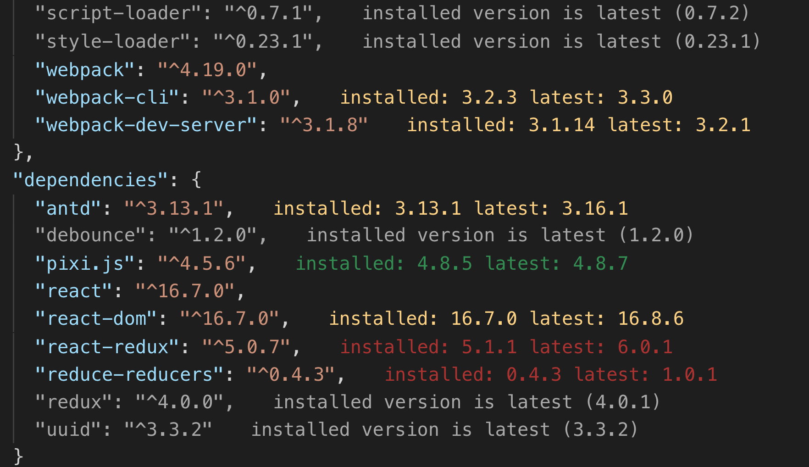

# better-package-json

Tool for managing project dependencies.
Inspired by [npm-gui](https://www.npmjs.com/package/npm-gui).

## Features

- annotate `package.json` files
- update all dependencies found in `package.json`, or just those patched with updates

## Release Notes

### 0.0.1

Initial public release
